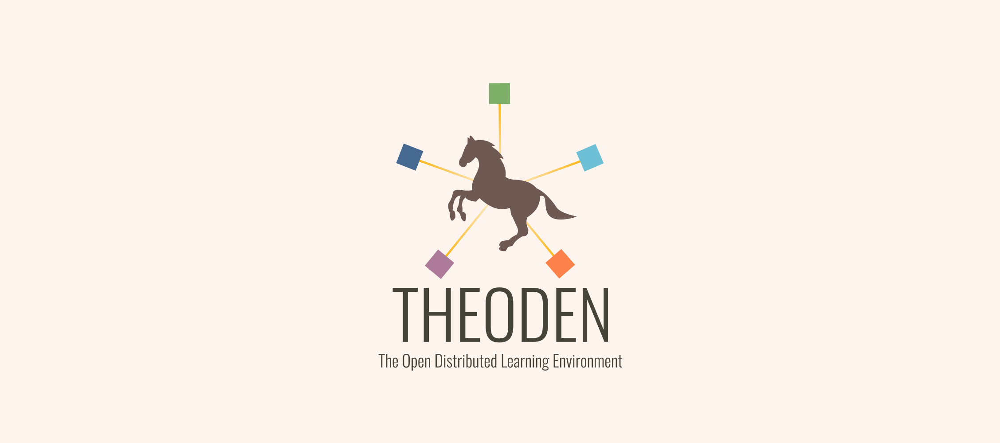
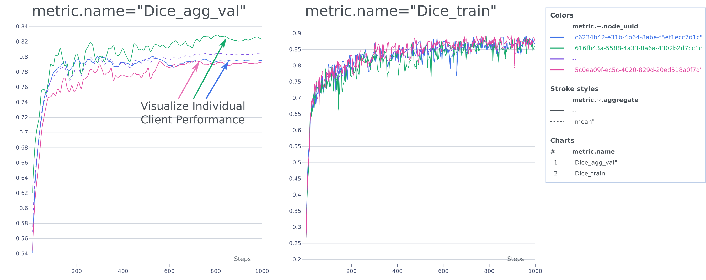

# **The**  **O**pen **D**istributed L**e**arning E**n**vironment (TheODen)

Welcome to TheODen – your **open-source solution for real-world cross-silo federated learning**, with a primary focus on medical data. While predominantly designed for PyTorch, it's adaptable to various other learning frameworks.

## Disclaimer

**Important Notice:** TheODen is currently in active development and is **not intended for production use** at this stage. We cannot guarantee backward compatibility for future releases, as the framework is continually evolving to enhance its capabilities.

**Security Note:** Please exercise caution and utilize TheODen only in trusted network environments. 

We appreciate your interest in TheODen and encourage you to explore its potential for research and experimentation. Your feedback and contributions are instrumental in shaping its development. Stay tuned for updates as we work towards making TheODen a robust and reliable solution for federated learning research. 🚧🧪🔒 

## Overview

The core philosophy of TheODen revolves around empowering researchers with versatile starting points to address the multifaceted challenges of federated learning. With TheODen, you gain fine-grained control over crucial aspects of the process, including:

-  **Data**: Easily manage and manipulate datasets, a fundamental component in any machine learning endeavor.
- **Models**: Develop and experiment with machine learning models tailored to your specific requirements.
- **Aggregation**: Customize the aggregation methods that consolidate knowledge from diverse sources.
- **Training**: Granularly control the training process across multiple clients.


## Getting Started


1. **Installation**: The repository requires Python 3.10 or greater. To install the requirements use the following command:  `pip install -r requirements.txt`
2. **Explore the Demo**: Get hands-on experience by checking out our demo, which demonstrates training on three clients using the BCSS dataset.
3. **Customization**: Tailor TheODen to your research needs. Add new datasets, modify data, experiment with different models, and explore unique aggregation methods – all without modifying the core framework.

## Demo

To experience a demonstration of TheODen using the BCSS dataset, follow these steps:

1. **Download BCSS Dataset**:

   Please download the BCSS dataset files by following the instructions in the [BCSS GitHub repository](https://github.com/PathologyDataScience/BCSS).

2. **Convert Data to TIF Files**:

   The built-in BCSS Dataset class requires data in TIF format. Convert the dataset to TIF files using this code snippet:

   ```python
   from theoden.datasets import WSIDataset

   WSIDataset("path/to/bcss/dataset", depth_metadata=["case"]).save_as_tif("path/to/tif/files")
   ```

3. **Define Global Context**:

   The Global Context contains system paths that need to be configured. Modify the `demo_context.yaml` file to suit your system, specifying the paths for dataset storage, partition storage, and model saving.

   ```yaml
   partition_folder: # Path to folder where the dataset partitions should be stored
   model_save_folder: # Path to folder where the models should be saved

   datasets:
     DEFAULT: # Default folder where datasets are stored / will be downloaded
     bcss: # Path to folder where the BCSS TIF dataset is stored
   ```

4. **Test Configuration**:

   Verify your configuration by running the following commands:

   ```python
   from theoden import GlobalContext
   from theoden.datasets import BCSSDataset
   import matplotlib.pyplot as plt

   GlobalContext().load_from_yaml("demo_context.yaml")
   bcss_dataset = BCSSDataset()
   bcss_dataset.sample(vmin=0, vmax=22)
   plt.show()
   ```

5. **Start the Server**:

   Launch the server using the following command:

   ```
   python demo_server.py
   ```

6. **Start Three Clients**:

   The demo is designed for three clients. In separate terminals, run the following command for each client:

   ```
   python demo_client.py
   ```

7. **Monitor the Process**:

   To monitor the training process, use the following command to start AIM:

   ```
   aim up
   ```

   AIM will display metrics with client IDs as context properties. You can visualize individual client training processes and compare them. The metrics' mean across all clients is also calculated and can be displayed.



Explore TheODen's capabilities through this demo and dive into the world of federated learning!


## Key Components

To run federated learning training, TheODen requires a server and multiple clients. You have the flexibility to choose between two types of servers:

- **Control Server**: This server has full control over the clients, managing their actions and commands.
- **Abstract Server**: In this configuration, the server provides abstract and top-level commands to the client, and the clients implement the commands themselves.

The framework is designed with modularity in mind, allowing you to replace every component with custom implementations. This flexibility extends to aggregation methods, data handling, models, commands, and more, all without altering the core codebase.

The primary components of TheODen framework are outlined below:

| Component Name | Function |
|---------------|----------|
| **Command**       | Commands serve as the core functionality, distributed by the server and executed on the clients. They encompass different types, including those setting specific resources (e.g., dataset, optimizer, loss) and action commands (e.g., training one epoch, sending models to the server, validation).  |
| **Instruction**   | Instructions form the foundation for server operations, handling command distribution, response management, status updates, and model aggregation. |
| **Stopper**       | Stoppers are essential for pausing command execution until specific criteria are met. For instance, they are used to wait for a certain number of clients to proceed. | 
| **Serverrequest** | Communication between clients and the server is unidirectional, with clients sending server requests and the server responding. This includes status updates, command requests, and more. | 
| **Watcher**       | Watchers monitor various aspects of the framework, such as metrics, and take actions based on specific tasks. They are also extensible, enabling the addition of new logging functionalities with ease. | 

Upon initiating the server, it receives a set of instructions responsible for managing the training process. Each instruction contains commands distributed to clients based on instruction settings, which are then executed on the clients. Clients send the command results back to the server for tasks such as aggregation and logging. The server communicates indirectly with clients, as clients periodically request new commands via REST calls. This design simplifies client-side requirements to a network connection without exposing API endpoints.

Explore the versatility of TheODen and streamline your federated learning research!

## Future Work

TheODen is a project in continuous evolution, with an exciting roadmap ahead. Here are some of the planned enhancements and additions:

- **Enhanced Security**: Strengthening security features to safeguard sensitive data in federated learning environments.

- **Orchestration and Training Process**: Improving the orchestration of training processes for more seamless and efficient federated learning.

- **Logging and Monitoring**: Enhancing logging and monitoring capabilities to provide deeper insights into model performance and system health.

- **Expanded Data Features**: Introducing more advanced data handling capabilities, including augmentations, partitions, and other data-related functionalities.

- **Additional Aggregation Methods**: Expanding the range of aggregation methods to suit a broader array of use cases and research scenarios.

Stay tuned for updates as we work diligently to make TheODen an even more powerful tool for your federated learning research needs. Your feedback and contributions are invaluable in shaping the future of this project. Let's innovate together! 🚀🧠 #TheODen #FederatedLearning #OpenSourceAI


