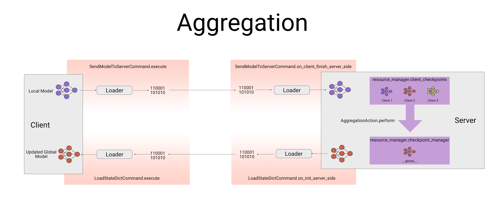

# Aggregation

Aggregation is a combination of client commands and an Aggregation Action as shown in the figure above.
## Current Aggregators

| Aggregator                  | Description                                                                     | Link                                     |
| --------------------------- |---------------------------------------------------------------------------------|------------------------------------------|
| `FedAvgAggregator`          | Aggregates the weights of the clients (e.g. mean) and send it as a new metric   | [link](../theoden/operations/instructions/aggregation/fedopt.py#L266)    |
| `MedianAggregator`          | Aggregates the weights of the clients (e.g. median) and send it as a new metric | [link](../theoden/operations/instructions/aggregation/fedmedian.py)  |
| `FedAdamServerOptimizer`    | Aggregates the weights using Adam Optimizer on the server.                      | [link](../theoden/operations/instructions/aggregation/fedopt.py#L132)     |
| `FedAdagradServerOptimizer` | Aggregates the weights using AdaGrad Optimizer on the server.                   | [link](../theoden/operations/instructions/aggregation/fedopt.py#L161)     |
| `FedYogiServerOptimizer`    | Aggregates the weights using Yogi Optimizer on the server.                      | [link](../theoden/operations/instructions/aggregation/fedopt.py#L173)     |

# Create an aggregator
   
Please refer to the tutorial [here](./TUTORIAL.md) to create a new aggregator.
