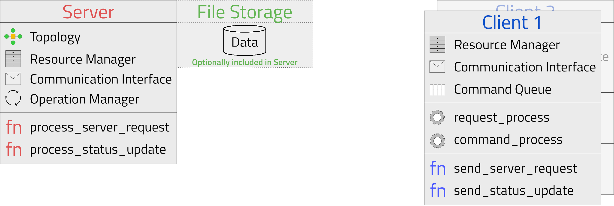

# Architecture Overview

As shown in the figure above, TheODen has three main components: the server, the file storage, and the client. 
The server is responsible for aggregating the metrics of the clients and sending it as a new metric. The file storage is responsible for weight sharing between clients and server. 
The client is responsible for training the model and sending the metrics to the server.

## Server

The server holds all information regarding the operations that will be carried out during one training run. This will be store in the operations manager.
Operations can access the servers operation manager to store information like the clients weights and the global model.

The Topology is a class that holds the internal topology representation of the server. It includes the server and all clients, their flags and the status (Online or Offline). The topology also holds the authentication manager, which is responsible for the authentication of the clients.

The whole communication is handled by the communication interface of the server. The server will send commands to the clients and receive status updates from them.

More information about the server can be found [here](./SERVER.md).

## Client

A client follows a producer consumer pattern. A request process is constantly asking the server for new commands. Whenever there is one, it will be added into a command queue. 
The command process will check if there are any objects in that queue and if that's the case, the command will be executed on the client.

To use objects, the command has access to the resource manager of the clients that acts as a cache for the client.
Before and after executing the client will send a status update to the server. All communication is handled using the communication interface of the client.

More information about the client can be found [here](./CLIENT.md).

## File Storage

The File Storage is just a simple class that is used for transferring the weights between the clients and the server.
Therefore, sending messages and the files are seperated. Whenever a file needs to be transmitted it will be uploaded to the file storage and return a UUID. With this UUID the file can be downloaded from the file storage.

The communication between server, client and file storage is handled by the storage interface that can be accessed through the resource manager.
The file storage can also be integrated into the server. However, this is only true if you use http(s) as the communication interface (alternative is RabbitMQ).

# Communication
